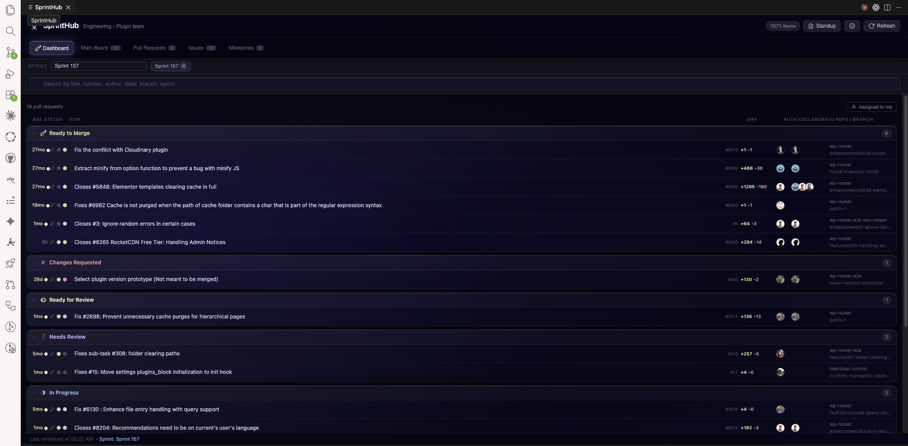

# SprintHub

**Your GitHub sprint board and PR hub — right inside VS Code.**

Stop switching between VS Code and the browser 30 times a day. SprintHub brings your GitHub Projects v2 board, pull request statuses, CI results, and sprint progress into a single panel where you already work.

---

## Screenshots

### Dashboard — PR hub grouped by action needed

### Detail panel — deep PR context without leaving the editor

### Daily standup — auto-generated from your GitHub activity

---

## Why SprintHub?

Most teams manage their sprint in GitHub Projects and their code in VS Code — but checking issue status, reviewing PRs, and tracking CI means constantly jumping to the browser. SprintHub closes that gap.

- ✅ See your full sprint board without leaving VS Code
- ✅ Know instantly which PRs need your attention
- ✅ Track CI pass/fail per PR at a glance
- ✅ Jump directly to changed files in the editor
- ✅ Filter everything by sprint in one click
- ✅ Generate your daily standup in one click

---

## Features

### 🚀 Dashboard
A high-signal PR hub showing every open pull request grouped by what needs action next:

| Group | What it means |
|---|---|
| **Ready to Merge** | Approved + all checks passing |
| **Changes Requested** | A reviewer asked for changes |
| **CI Failing** | One or more checks are red |
| **Ready for Review** | In the "Ready for Review" column, awaiting a reviewer |
| **Needs Review** | No reviewer assigned yet |
| **In Progress** | Actively being worked on |
| **Draft** | Not ready for review yet |

**Assigned to me filter** — one click to see only PRs you authored, are assigned to, or were requested to review.

**Waiting on me highlight** — rows where you are a requested reviewer are highlighted in purple so you can't miss them.

**Stale badge** — PRs with no activity for more than 7 days show an amber indicator.

### 🔍 Detail panel
Click any item to open a rich side panel with full context:

- **PR quality score** — colored flags for: stale (>7 days), large (>500 lines), no description, no reviewers, no tests changed
- **Changed files** — full list of every file touched, with diff stats and search when there are many
- **CODEOWNERS hints** — shows which team owns each changed file
- **Copy branch** — one click to copy the branch name to your clipboard
- **Work on This** — checks out the branch in your current workspace terminal
- **Draft → Ready** — convert a draft PR to ready for review without opening GitHub
- **Merge** — squash, merge commit, or rebase — right from the panel (only shown when CI is passing + approved)
- **Metadata editor** — add or remove labels on issues without leaving VS Code
- **Linked PRs & CI** — for issues, see all linked PRs and their check run results

### 📋 Main Board
Full Kanban view of your GitHub Project v2. Filter by sprint, search by keyword, click any item to read its description — without opening a browser tab.

### 🏁 Milestones
Browse all milestones and drill into the issues attached to each one.

### 📝 Daily Standup
Click **Standup** in the header to generate a markdown summary of your last 24 hours of GitHub activity: merged PRs, open PRs, closed issues. Toggle between **View** (rendered) and **Markdown** (raw) to copy it wherever you need it.

### ⚠️ Conflict Detection
SprintHub watches your local dirty files and alerts you when they overlap with files modified by other open PRs — so you know about potential merge conflicts before they happen.

### ⚙️ Settings
Configure everything inside the extension. Supports light/dark themes, color-blind mode, and a Liquid Glass UI style.

---

## Setup

1. Install SprintHub from the VS Code Marketplace
2. Click the **SprintHub icon** in the activity bar → **Open SprintHub**
3. Click the **⚙️ Settings** icon (top-right)
4. Enter:
   - **Owner** — your GitHub org or username
   - **Project number** — the number in your GitHub Project URL (`/projects/42` → `42`)
   - **Owner type** — Organization or User
5. Hit **Save** — your board loads instantly

> SprintHub uses your existing VS Code GitHub authentication. No extra login or token setup required.

---

## Requirements

- VS Code 1.85 or newer
- GitHub account signed in through VS Code
- A [GitHub Project v2](https://docs.github.com/en/issues/planning-and-tracking-with-projects/learning-about-projects/about-projects) (classic Projects v1 are not supported)

---

## Settings Reference

| Setting | Default | Description |
|---|---|---|
| `sprinthub.owner` | `""` | GitHub org or username |
| `sprinthub.projectNumber` | `0` | GitHub Project v2 number |
| `sprinthub.ownerType` | `"organization"` | `"organization"` or `"user"` |
| `sprinthub.statusFieldName` | `"Status"` | Name of your board's status field |
| `sprinthub.refreshInterval` | `5` | Auto-refresh in minutes (0 = off) |
| `sprinthub.colorBlind` | `false` | Replaces red/green signals with orange/blue |
| `sprinthub.liquidGlass` | `false` | Frosted-glass UI with blur and depth |
| `sprinthub.theme` | `"dark"` | `"dark"` or `"light"` |

---

## Tips

**Sprint filter** — select a sprint in the toolbar to filter the board and dashboard simultaneously.

**Linked PRs** — the Dashboard picks up PRs linked to board issues via `Fixes #N`, `Closes #N`, `Resolves #N` in the PR body — even when the PR isn't on the board itself.

**CI dots** — each PR row shows a dot: 🟢 passing, 🔴 failing, 🟡 pending, ⚪ no CI. Click a row to expand check-run details.

**File jump** — in the detail panel, click any changed file to open it at the relevant diff hunk in the VS Code editor.

**Blockers quick-pick** — run `SprintHub: Show Blockers` from the Command Palette to see PRs with CI failures or pending reviews in a searchable list.

**Color-blind mode** — enable in Settings to replace all red/green signals with orange/blue.

---

## Privacy

SprintHub reads data exclusively from GitHub using your VS Code GitHub session token. No data is sent to any third-party service. All requests go directly to `api.github.com`.

---

## Feedback & Contributing

Found a bug or have a feature idea? [Open an issue](https://github.com/Miraeld/sprinthub/issues) — contributions are welcome!
