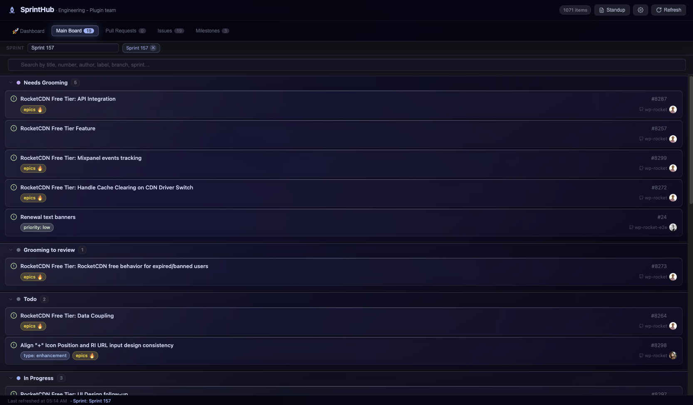
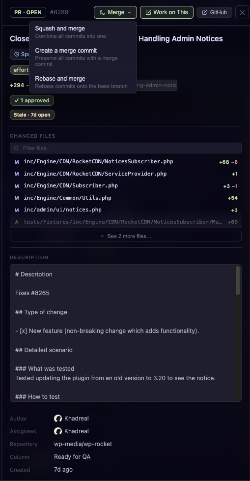
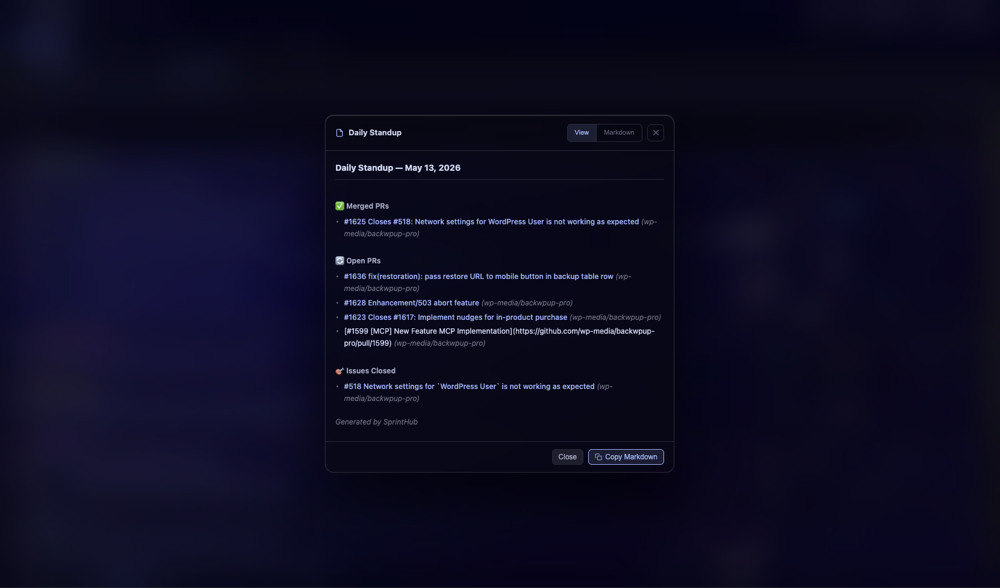
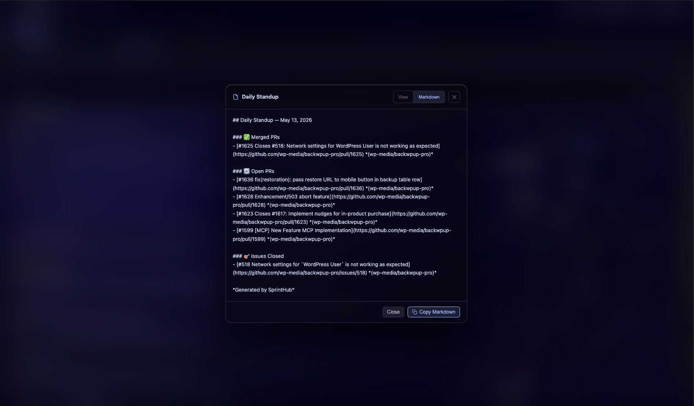
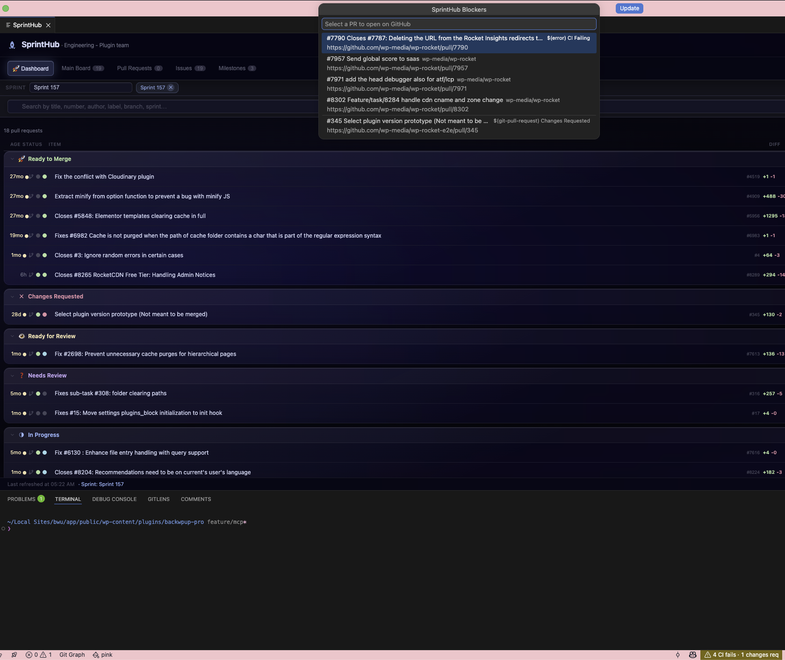
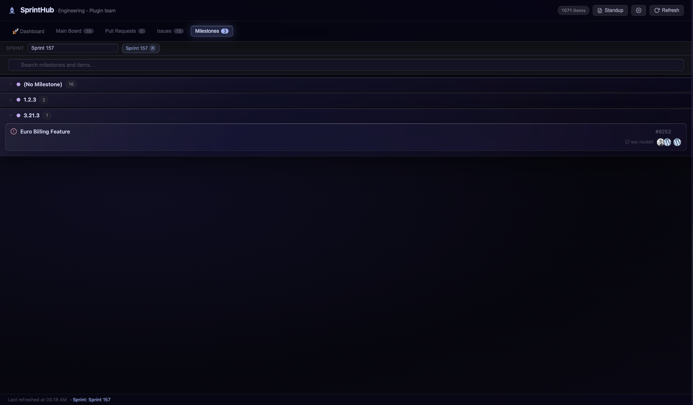

# SprintHub

**Your GitHub sprint board, PR hub, and standup generator — right inside VS Code.**

SprintHub is a VS Code extension that connects directly to your GitHub Projects v2 board and surfaces everything your team needs to move work forward — without switching windows. It reads your project's issues, pull requests, CI statuses, sprint iterations, and review states in real time and presents them in a purpose-built panel alongside your code.

---

## Dashboard — act on what matters, instantly

The Dashboard is SprintHub's main view. It fetches every open pull request linked to your board — including PRs that close a board issue via `Fixes #N` syntax, even if the PR itself isn't on the board — and groups them by what action is needed next.

Each row shows the PR's age, CI status (pass/fail/pending), review status (approved/changes requested/pending), diff size, assignees, and branch name. You never need to open GitHub to answer "what's blocking this?"

| Group | When it appears |
|---|---|
| 🚀 **Ready to Merge** | Approved by at least one reviewer and all CI checks passing |
| ✗ **Changes Requested** | At least one reviewer requested changes |
| ✕ **CI Failing** | One or more check runs returned failure or error |
| 👁 **Ready for Review** | PR is in the "Ready for Review" board column, no review yet |
| ❓ **Needs Review** | No reviewer assigned and no review activity |
| ◑ **In Progress** | Open, non-draft, with review activity but not yet approved |
| ✎ **Draft** | Marked as draft on GitHub |

**Assigned to me** — a one-click filter that reduces the list to PRs you authored, are assigned to, or have been asked to review.

**Waiting on me** — rows where you appear as a requested reviewer are highlighted with a purple accent so you can't miss a review request buried in a long list.

**Stale badge** — PRs with no activity for more than 7 days show an amber indicator in the age column.

---

## Main Board — your full sprint Kanban

The Main Board tab mirrors your GitHub Project v2 exactly: every column, every issue, every pull request, in the same order. You can filter the entire board by sprint iteration with a single dropdown, or search by title, number, author, label, branch name, or sprint name.

Clicking any card opens the detail panel (see below) without leaving the editor.

---

## Detail panel — deep context, no context switch

Clicking any item — whether from the dashboard, the board, or a milestone — opens a side panel with everything you need to understand and act on that PR or issue.

For pull requests, the panel shows:
- **PR quality flags** — colored chips that surface risks before you waste time reviewing: stale (open >7 days), large diff (>500 lines changed), no description written, no reviewers assigned, no test files touched
- **Changed files** — every file modified, with per-file diff stats (+/-), a filter input when the list is long, and CODEOWNERS hints showing which team owns each file
- **Review summary** — how many approvals, how many change requests, who is still pending
- **CI badge** — overall pass/fail/pending, expandable to individual check run results with links to the CI provider
- **Description** — the full PR body rendered as text
- **Metadata** — author, assignees, repository, column, created/updated times

For issues, the panel shows linked pull requests with their CI states, and a metadata editor to add or remove labels without opening GitHub.

---

## Merge without leaving VS Code

When a PR has at least one approval and all CI checks are passing, a **Merge** button appears in the detail panel header. Clicking it opens a dropdown with three options — squash and merge, create a merge commit, or rebase and merge. The merge is performed via the GitHub API and the panel updates immediately.

Other actions available directly in the panel:

- **Copy branch name** — copies the branch to your clipboard; a checkmark confirms for 1.8 seconds
- **Work on This** — runs `git checkout` (or fetch + checkout) in a VS Code terminal, switching your workspace to that branch
- **Draft → Ready** — converts a draft PR to ready for review via the GitHub API, no browser needed
- **CODEOWNERS hints** — parsed from your repo's `CODEOWNERS` file (`.github/CODEOWNERS`, `CODEOWNERS`, or `docs/CODEOWNERS`), shown inline next to each changed file
- **File jump** — clicking a file opens it in the editor at the relevant diff hunk

---

## Daily standup — generated in one click

Click **Standup** in the top bar. SprintHub queries the GitHub search API for your activity in the last 24 hours — merged PRs, open PRs, and closed issues — and produces a structured markdown summary attributed to your GitHub login.

**View mode** — the standup renders as readable HTML with clickable PR links.

**Markdown mode** — the raw markdown is shown, ready to copy and paste into Slack, Notion, Jira, or your team's standup bot.

Click **Copy Markdown** to put it on your clipboard in one step.

---

## Blockers — one command, full picture

Run **SprintHub: Show Blockers** from the Command Palette, or click the status bar item SprintHub adds. A searchable quick-pick lists every PR on your board that is currently blocked — CI failure, changes requested, or no reviewer — with a description of the specific blocker and a link to open it on GitHub.

This is useful in standups, team syncs, or any time you want a fast answer to "what's actually stuck right now."

---

## Milestones

The Milestones tab groups every issue and PR from your board by its GitHub milestone. Useful for checking progress toward a release or a specific deliverable without building a separate view in GitHub.

---

## Conflict detection

SprintHub watches your local workspace for uncommitted changes and periodically compares them against the files modified by other open PRs on the board. When overlap is detected — meaning you and another PR are both touching the same file — a dismissible warning banner appears at the top of the panel listing the affected files and which PRs they conflict with.

---

## Setup — 2 minutes

1. Install **SprintHub** from the VS Code Marketplace
2. Click the SprintHub rocket icon in the activity bar → **Open SprintHub**
3. Click **⚙️** (top-right) to open Settings
4. Fill in:
   - **Owner** — your GitHub organization name or personal username
   - **Project number** — the number in your GitHub Project URL (`.../projects/42` → `42`)
   - **Owner type** — Organization or User
5. Click **Save** — the board loads immediately

SprintHub uses the GitHub session that VS Code already manages. No personal access tokens, no OAuth flow, no extra setup.

---

## Settings

| Setting | Default | Description |
|---|---|---|
| `sprinthub.owner` | `""` | GitHub org or username |
| `sprinthub.projectNumber` | `0` | GitHub Project v2 number |
| `sprinthub.ownerType` | `"organization"` | `"organization"` or `"user"` |
| `sprinthub.statusFieldName` | `"Status"` | Exact name of your board's status column field |
| `sprinthub.refreshInterval` | `5` | Auto-refresh interval in minutes (0 to disable) |
| `sprinthub.liquidGlass` | `true` | Frosted-glass UI with backdrop blur and depth |
| `sprinthub.theme` | `"dark"` | `"dark"` or `"light"` |
| `sprinthub.colorBlind` | `false` | Replaces all red/green signals with orange/blue |

---

## Requirements

- VS Code 1.85 or newer
- A GitHub account signed in through VS Code (`GitHub Authentication` extension, bundled by default)
- A [GitHub Project v2](https://docs.github.com/en/issues/planning-and-tracking-with-projects/learning-about-projects/about-projects) — classic Projects (v1) are not supported

---

## Privacy

SprintHub communicates exclusively with `api.github.com` using your VS Code GitHub session token. No data is sent to any third-party server, no telemetry is collected, and nothing is stored outside of your local VS Code settings.

---

[Report a bug or request a feature →](https://github.com/Miraeld/sprinthub/issues)
